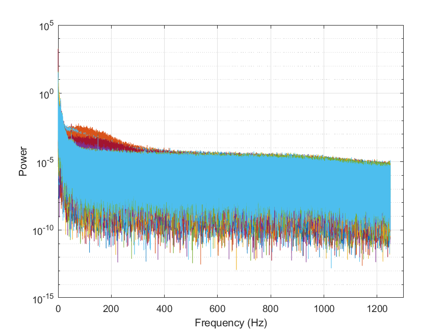
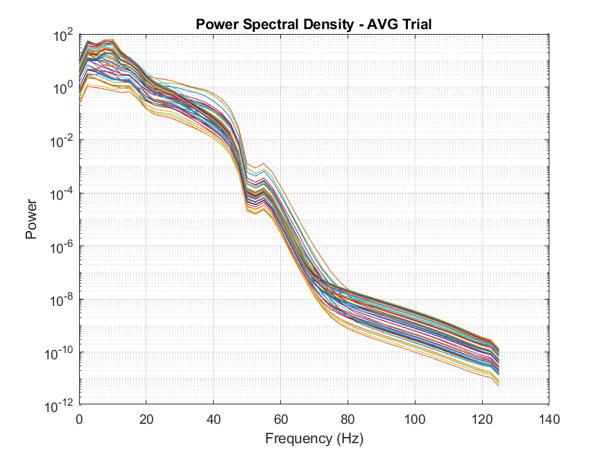

# Preprocessing for EEG 
 
## Requirements

Make sure you have the following dependencies installed before running the project:

- [Fieldtrip](https://www.fieldtriptoolbox.org/download/)
- Signal Processing Toolbox
- [EEGlab](https://eeglab.org/#The_EEGLAB_Tutorial_Outline)

  ## Result

 Power Spectral Density in the raw Data 
 

 Power Spectral Density after preprocessing
 
 
